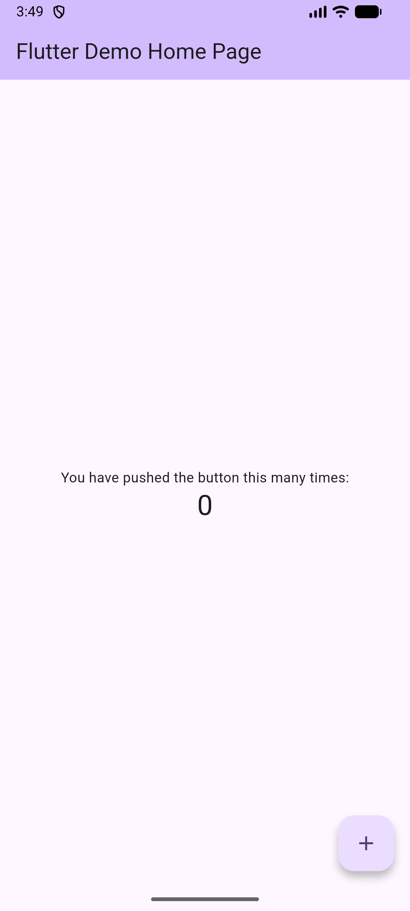
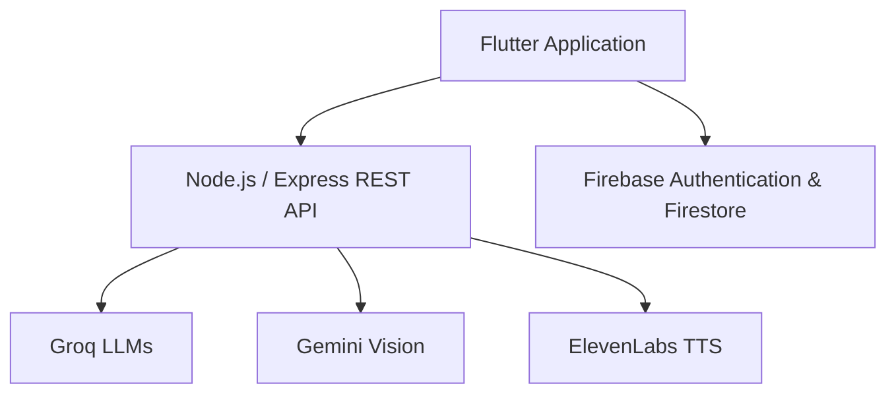

# KiddoLia — AI-Powered Educational Application



KiddoLia is an AI-powered educational application designed for children aged 4–6. It combines conversational AI, voice interaction, visual recognition, interactive stories, creative activities, mini-games, and parental controls in a child-friendly mobile experience.

The application is built with Flutter and supported by a Node.js/Express backend, Firebase services, and multiple AI APIs.

## Key Features

### Voice-Enabled AI Avatar

* Allows children to communicate with an animated avatar through speech.
* Produces short, age-appropriate Turkish responses.
* Uses recent conversation context and configured interests to personalize interactions.
* Applies rule-based safety checks before displaying AI-generated responses.
* Converts avatar responses into natural speech.

### Room Exploration

* Encourages children to recognize and discuss objects in a virtual room.
* Uses image and text input to evaluate the child’s answers.
* Provides short, supportive, and age-appropriate feedback.
* Uses multimodal AI to process visual information.

### Interactive and Classic Stories

* Provides both narrated classic stories and choice-based interactive stories.
* Tracks decisions made during interactive stories.
* Generates parent-facing developmental observations based on story choices.
* Clearly states that generated observations are not psychological diagnoses.

### Drawing and Coloring

* Includes free drawing and interactive coloring activities.
* Allows completed artwork to be saved to the parent panel.
* Stores saved artwork for up to seven days.
* Automatically removes expired artwork records.

### Music

* Includes a child-friendly music player with multiple songs.
* Provides playback, pause, seek, and navigation controls.

### Beach Preparation Mini-Game

* Teaches children which clothes and objects are suitable for a beach trip.
* Provides spoken hints and positive feedback.
* Supports learning through interactive object selection.

### Parent Panel

The parent panel allows parents to:

* Review conversation summaries.
* View potentially risky content and its category.
* Review interactive story results.
* Access saved drawings and coloring activities.
* Configure the child’s daily usage limit.
* Manage interests and developmental goals.
* View daily, weekly, and monthly interest/emotion insights.
* Review records retained for up to seven days.

## AI and External Services

| Service                        | Purpose                                      |
| ------------------------------ | -------------------------------------------- |
| Groq — Llama 3.1 8B Instant    | Fast conversational avatar responses         |
| Groq — Llama 3.3 70B Versatile | Story analysis and interest/emotion insights |
| Gemini 2.5 Flash               | Multimodal room and object evaluation        |
| ElevenLabs                     | Natural text-to-speech generation            |
| Firebase Authentication        | User registration and authentication         |
| Cloud Firestore                | User settings, chat data, and saved artwork  |

## Technology Stack

### Mobile Application

* Flutter
* Dart
* Material 3
* Firebase Authentication
* Cloud Firestore
* Speech-to-Text
* Audio and video playback
* Flutter TTS
* SVG and 3D model support

### Backend

* Node.js
* Express.js
* REST APIs
* Groq API
* Gemini API
* ElevenLabs API
* CORS
* dotenv

## Architecture



The backend currently exposes 17 REST endpoints for chat, speech generation, visual room evaluation, conversation records, interactive story results, parental insights, and health monitoring.

## Project Structure

```text
kiddoai-backup/
├── assets/                    # Images, audio, videos, stories and 3D assets
├── lib/
│   ├── pages/                 # Application screens and modules
│   ├── services/              # Chat, settings, TTS and Firebase services
│   ├── firebase_options.dart
│   └── main.dart
├── kiddoai-backend/
│   ├── server.js              # Express REST API and AI integrations
│   ├── package.json
│   └── .env                   # Local environment variables — do not commit
├── android/
├── ios/
├── web/
├── windows/
├── pubspec.yaml
└── README.md
```

## Getting Started

### Requirements

* Flutter SDK
* Dart SDK 3.11 or later
* Node.js and npm
* A Firebase project
* Groq API key
* Gemini API key
* ElevenLabs API keys and voice IDs

### 1. Clone the repository

```bash
git clone https://github.com/Cansu-Onal/kiddoai-backup.git
cd kiddoai-backup
```

### 2. Install Flutter dependencies

```bash
flutter pub get
```

### 3. Configure Firebase

Install and use the FlutterFire CLI to connect the application to your own Firebase project:

```bash
flutterfire configure
```

Enable the following Firebase services:

* Email/password authentication
* Cloud Firestore

Firebase security rules should be configured before using the application outside a development environment.

### 4. Configure the backend

Navigate to the backend directory and install dependencies:

```bash
cd kiddoai-backend
npm install
```

Create a `.env` file inside `kiddoai-backend`:

```env
PORT=3000

GROQ_API_KEY=your_groq_api_key
GEMINI_API_KEY=your_gemini_api_key

ELEVENLABS_API_KEY1=your_api_key
ELEVENLABS_VOICE_ID1=your_voice_id


Never commit the `.env` file or real API credentials.

### 5. Start the backend

```bash
npm start
```

The backend runs on:

```text
http://localhost:3000
```

You can verify it through:

```text
http://localhost:3000/health
```

### 6. Start the Flutter application

Return to the project root:

```bash
cd ..
flutter run
```

For an Android emulator, the application uses:

```text
http://10.0.2.2:3000
```

For Flutter Web, it uses:

```text
http://localhost:3000
```

When running the application on a physical device, replace the development URL with the local IP address of the computer running the backend.

## Safety and Privacy

KiddoLia includes:

* Parent approval during registration.
* Age-appropriate system prompts.
* Output filtering and safe fallback responses.
* Risk-related conversation monitoring.
* Configurable daily usage limits.
* Seven-day retention rules for selected activity records.
* Clear notices that generated observations are not psychological diagnoses.

This project is an educational prototype. It should not be treated as a psychological assessment or professional child-development service.

## Current Limitations

* Some backend conversation and story records are stored in memory and are cleared when the backend restarts.
* Development URLs are configured for local environments.
* AI responses depend on third-party API availability.
* Production deployment requires stricter authentication, Firebase security rules, rate limiting, and secret management.

## Developer

**Cansu Önal**

* GitHub: [Cansu-Onal](https://github.com/Cansu-Onal)
